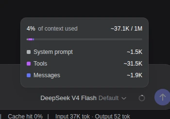

# DSH Tool Gate

**Progressive capability gating for DeepSeek Harness. Keep large MCP tool schemas out of the model context until the agent actually needs them, then expose the original native tools on demand.**

## Measured result

In my own DeepSeek Harness setup with large Blender and Godot MCP servers, Tool Gate reduced the **fresh-session visible tool-schema footprint from ~31.5K tokens to ~6.7K tokens — a 78.7% reduction (~80%)**.

| Fresh-session metric | Tool Gate OFF | Tool Gate ON | Reduction |
| --- | ---: | ---: | ---: |
| Visible tool schemas | ~31.5K tokens | ~6.7K tokens | **78.7%** |
| Total initial context | ~37.1K tokens | ~9.8K tokens | **73.6%** |
| First-request input | ~37K tokens | ~9.7K tokens | **73.8%** |

These are measurements from my own DSH configuration, not a universal claim. Savings depend on the number and size of specialist tool suites you normally expose.

### Before — Tool Gate OFF



### After — Tool Gate ON


The benchmark used the same model, same agent preset, same simple fresh-session message, and 0% cache hit. The important difference was the visible tool surface.

## Short demo

A fresh session keeps the normal agent-preset tools immediately available while specialist MCP suites stay hidden behind one tiny launcher:

```text
Fresh session
├── standard agent-preset tools
├── enable_toolset
├── Blender — available, not loaded
└── Godot AI — available, not loaded
```

When the agent needs Blender:

```text
enable_toolset("blender")
        ↓
22 original native Blender MCP tools become visible
        ↓
Godot remains hidden
```

There is no `mcp_search` or generic `mcp_call` proxy. Once enabled, the model sees and calls the original native DSH/MCP tools directly.

## What it does

DeepSeek Harness sends every visible native tool definition to the model. Large MCP suites can therefore consume tens of thousands of input/context tokens even in a conversation that never uses them.

DSH Tool Gate keeps specialist capability groups in DSH's real registry but removes their schemas from one agent's visible surface until that agent explicitly loads the capability.

```text
Session starts
  agent-preset tools immediately visible
  CCE / other always-on tools
  enable_toolset

User asks for Blender work
  agent calls enable_toolset({ toolset: "blender" })
  -> every native Blender MCP tool becomes visible
  -> agent calls those native tools normally

Later the same session needs Godot
  agent calls enable_toolset({ toolset: "godot-ai" })
  -> Godot tools are added too
  -> Blender remains loaded
```

## Why this saves tokens

DSH's own tool registry documents that native tool schema cost is proportional to the visible definitions and that scoped restrictions remove the entire hidden schema cost for that agent. Tool Gate uses that exact mechanism.

The plugin also estimates schema cost using the same rough 4-bytes-per-token composition heuristic used by DSH's context meter. With `debug: true`, it logs how many tools/toolsets are hidden and the approximate schema tokens removed per request.

## Discovery

### MCP — automatic

Current DSH gives every MCP tool a deterministic public name:

```text
mcp__<serverName>__<toolName>
```

Tool Gate uses that documented public naming contract only to group tools by MCP server. It never reconstructs raw MCP call names and never proxies MCP execution.

So these automatically become two optional toolsets:

```text
mcp__blender__get_scene
mcp__blender__pose_bone

mcp__godot-ai__run_project
mcp__godot-ai__inspect_scene
```

→ `blender`

→ `godot-ai`

### Ordinary plugins — explicit grouping

DSH's public tool registry currently exposes the final visible schemas but not a general "which Cordis plugin registered this tool" provenance field. Tool Gate therefore does **not** invent ownership heuristics for arbitrary plugins.

Non-MCP plugin suites can be grouped with public-tool globs:

```yaml
config:
  toolsets:
    - id: github
      description: GitHub repository, issue, and pull-request operations.
      match: ["github_*"]
      visibility: lazy
```

Explicit rules take precedence over automatic MCP grouping and can also mark a group `always`.

## Agent preset precedence

An agent preset is the agent's normal working capability surface. Tool Gate does **not** hide ordinary tools merely because they were registered by the preset. Normal preset tools such as shell, filesystem, search, todo, subagent, workflow, and similar native DSH capabilities are visible from the first model request.

The default precedence is:

```text
ordinary agent-preset tool     -> visible immediately
ordinary ungrouped plugin tool -> visible immediately
explicit visibility: always    -> visible immediately
MCP tool with autoMcp: true     -> lazy
explicit visibility: lazy      -> lazy
```

MCP classification remains capability policy even when an MCP client is mounted as a row inside the agent preset. For example, a preset may provide `bash`, `read_file`, and Blender MCP together; `bash` and `read_file` remain visible immediately while the Blender schemas stay behind `enable_toolset("blender")`.

## Runtime behavior

Tool Gate installs one agent-scoped controller before the agent's first driving request. It:

1. Reads that agent's effective native tool surface, including its preset composition.
2. Leaves ordinary preset/ungrouped tools visible.
3. Builds capability groups for automatic MCP and explicitly configured toolsets.
4. Applies `agent.ctx.tools.restrict({ deny: [...] })` only for lazy groups.
5. Registers a tiny scoped `enable_toolset` tool.
6. Replaces the restriction when a toolset is enabled.
7. Keeps enabled groups sticky for the rest of that agent lifecycle.
8. Rebuilds the catalog after real `tools/change` events such as MCP list changes or plugin hot reload.

Other agents are unaffected.

## Configuration

```yaml
- id: dsh-tool-gate
  name: dsh-tool-gate
  config:
    enabled: true
    autoMcp: true
    launcherToolName: enable_toolset
    debug: false
    toolsets: []
```

Example with an additional plugin group:

```yaml
- id: dsh-tool-gate
  name: dsh-tool-gate
  config:
    enabled: true
    autoMcp: true
    debug: true
    toolsets:
      - id: github
        description: GitHub repository, issue, and pull-request operations.
        match: ["github_*"]
        visibility: lazy
      - id: continuity
        description: Small continuity tools that should always stay visible.
        match: ["cce_*"]
        visibility: always
```

`match` supports one wildcard: `*`.

## Design invariants

- **Preset working surface stays immediate.** Ordinary tools supplied by the selected agent preset are visible on the first request unless a deliberate lazy policy classifies them.
- **Native execution stays authoritative.** Tool Gate only controls visibility.
- **Hidden means unavailable.** DSH's same scoped registry view controls presentation, lookup, and execution.
- **Agent-local.** One agent loading Blender does not expose Blender to another agent.
- **Sticky expansion.** Enabled suites are not automatically unloaded each turn.
- **No fake provenance.** MCP grouping uses DSH's documented naming contract; arbitrary plugin grouping is explicit until DSH exposes registration ownership publicly.
- **Measurable savings.** Every toolset records tool count, serialized schema bytes, and estimated schema tokens.

## Repository layout

```text
src/
  index.ts          plugin config + agent/registry lifecycle
  gate.ts           per-agent restriction + enable_toolset controller
  catalog.ts        MCP/custom grouping + token/schema metrics
  types.ts          public domain types

tests/
  scaffold.spec.ts  plugin contract
  catalog.spec.ts   discovery/grouping/metrics
  gate.spec.ts      scoped visibility + preset/MCP/native execution lifecycle

docs/
  ARCHITECTURE.md   design, DSH findings, and invariants
  benchmark/        before/after context-meter screenshots

cordis.patch.yml    DSH bundle/profile insertion
```

## Development

```bash
pnpm install
pnpm run check
pnpm run build
```

Target runtime: modern DeepSeek Harness / Node.js 22.19+.

## Version 1 status

**Version 1 is implemented and locally validated.** TypeScript typecheck passes and the current test suite passes all 16 tests, covering automatic MCP grouping, immediate ordinary preset tools, per-agent native gating, sticky `enable_toolset`, explicit plugin groups, schema/token diagnostics, hot-change refresh, scoped execution, and preset/MCP visibility behavior.

This is an unofficial community plugin for DeepSeek Harness.
